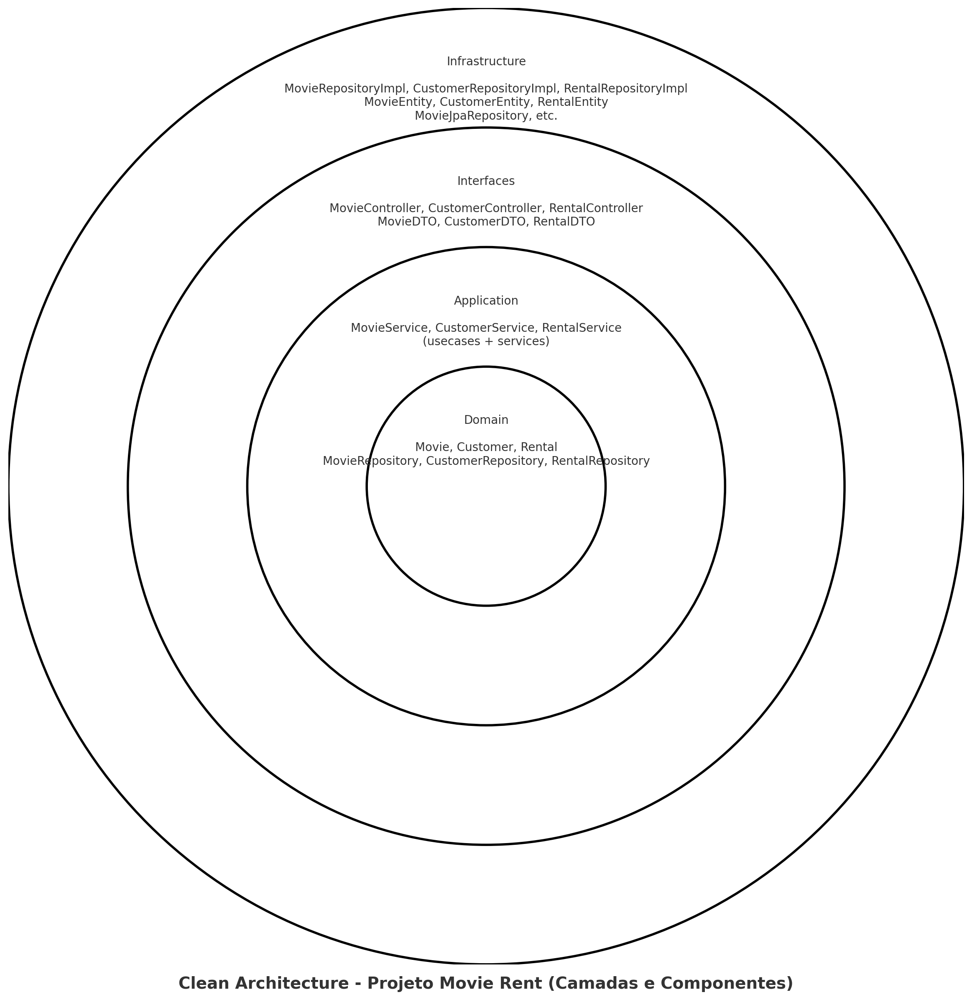

# Movie Rent - Projeto de Estudo

Projeto desenvolvido para estudo prático de **Clean Architecture** e dos princípios **SOLID**, utilizando Java 21, Spring Boot 3.4 e JPA com H2.

---

## 📊 Objetivos

- Aplicar os 5 princípios SOLID de forma concreta
- Implementar a Clean Architecture separando responsabilidades por camada
- Criar um sistema de aluguel de filmes com domínio rico e persistência desacoplada
- Garantir testabilidade e escalabilidade através de boas práticas de design

---

## 📂 Estrutura do Projeto (Módulos)

### `domain/`
Contém as entidades do modelo de negócio e as interfaces de repositório.

**Classes principais:**
- `Movie`, `Customer`, `Rental`: representam as entidades do sistema.
- `MovieRepository`, `CustomerRepository`, `RentalRepository`: contratos que definem as operações do repositório (abstrações).

### `application/`
Responsável por conter os casos de uso da aplicação, organizados em interfaces e implementações.

**Pacotes:**
- `usecases`: interfaces como `MovieService`, `CustomerService`, `RentalService`
- `services`: implementações concretas dos casos de uso (`*ServiceImpl`)

### `interfaces/`
Camada de entrada (interface com o mundo externo), via controladores REST e DTOs.

**Componentes:**
- `MovieController`, `CustomerController`, `RentalController`: endpoints REST.
- `MovieDTO`, `CustomerDTO`, `RentalDTO`: objetos de entrada/saída da API.

### `infrastructure/`
Implementação dos repositórios usando JPA, configurações de banco e DI.

**Componentes:**
- `*JpaRepository`: interfaces do Spring Data.
- `*RepositoryImpl`: adaptação entre Spring Data e repositórios de domínio.
- `BeansConfig`: classe com métodos `@Bean` que conectam as dependências manualmente.
- `*Entity`: entidades JPA separadas do domínio.

---

## 🔄 Diagrama de Relacionamentos (Camada de Cebola)

> O projeto segue o fluxo de dependências de **fora para dentro**, respeitando a Clean Architecture.



Se quiser utilizar no GitHub:
1. Salve a imagem do diagrama como `docs/clean-architecture-diagrama.png`
2. Adicione ao repositório

---

## 📋 Explicação das Classes e Métodos

### `Movie`
- Entidade do domínio com: `id`, `title`, `genre`, `releaseYear`, `available`
- Controla o estado de disponibilidade do filme

### `MovieRepository`
- Interface de acesso a dados do domínio
  - `findById(Long id)`
  - `save(Movie movie)`

### `MovieServiceImpl`
- Implementa `MovieService`
  - `registerMovie(Movie movie)`
  - `findMovieById(Long id)`

### `MovieRepositoryImpl`
- Implementa `MovieRepository`
- Usa `MovieJpaRepository` para persistência
- Converte entre `Movie` (domínio) e `MovieEntity` (infraestrutura)

### `MovieController`
- Endpoint `/movies`
- POST para registrar, GET para buscar por ID
- Converte `MovieDTO` para `Movie` e vice-versa

> Similar para `Customer`, `Rental`, com as respectivas classes e lógicas de negócio.

---

## 🔄 Fluxo de Execução

1. `POST /movies` recebe um `MovieDTO`
2. `MovieController` chama `movieService.registerMovie()`
3. `MovieServiceImpl` usa `MovieRepository.save()`
4. `MovieRepositoryImpl` converte para `MovieEntity` e chama o JPA
5. Objeto é salvo no banco
6. O retorno volta convertido como `MovieDTO`

---

## 📄 Execução Local

```bash
mvn clean install
cd bootstrap
mvn spring-boot:run
```

Endpoints ativos em: `http://localhost:8080`

---

## 📊 Futuras Extensões

- Melhorar tratativas de erro com `@ControllerAdvice`
- Separar DTOs de entrada e de saída
- Usar MapStruct para mapping automático
- Adicionar testes unitários e de integração

---

> Este projeto representa uma implementação fiel aos princípios de **arquitetura limpa** e **design orientado a objetos**, com foco em manutenção, testabilidade e desacoplamento.
